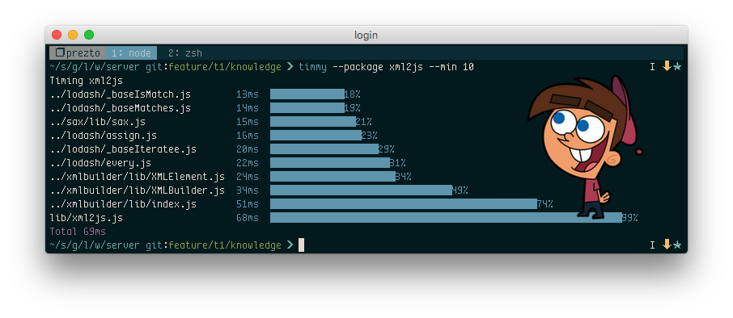

# Timmy

> Find out how long it takes to require a file or node module



## Installation

```shell
$ yarn global add @mishguru/timmy
```

## CLI Usage

### --file [path to file]

Time a file

```shell
$ timmy --file ./index.js
```

### --package [name of package]

Time a package from `node_modules`

```shell
$ timmy --package bluebird
```

### --quiet

Don't time individual require's, just print out the total time it took to load
the file/package.

This is more accurate, as it does not include the overhead Timmy adds when
collecting statistics.

```shell
$ timmy --package bluebird --quiet
```

### --min [time = 100]

Set the minimum amount of time (in ms) that a `require` must take for it to
show up in the results. This is to improve performance  - the lower the time, the
more stats that need collecting - the longer it takes to run.

This defaults to 100ms.

```shell
$ timmy --file ./index.js --min 50
```

## JS Usage

You can also use Timmy via a JS api

### printStats (cwd)

Print out all the times for required files up to this point.

You should call it once, immediately after you have finished requiring all your
files.

```javascript
import timmy from '@mishguru/timmy'

import 'allthethings'

timmy.printStats()
```

### restoreRequire

This restores `require()` to it's default behaviour.

```javascript
import timmy from '@mishguru/timmy'

// this require will be timed
require('thing-one')

timmy.restoreRequire()

// this require will not be timed
require('thing-two')
```

### resetTimer
import timmy from '@mishguru/timmy'

This resets the total timer to the current time.

```javascript
import timmy from '@mishguru/timmy'

// do a bunch of stuff that you don't want to time ...

timmy.resetTimer()

// require the files you want to time

timmy.printStats()
```

### setMinDuration

This sets the min duration to record. You should set this before you start
requiring files.

```javascript
import timmy from '@mishguru/timmy'
timmy.setMinDuration(0)
```

